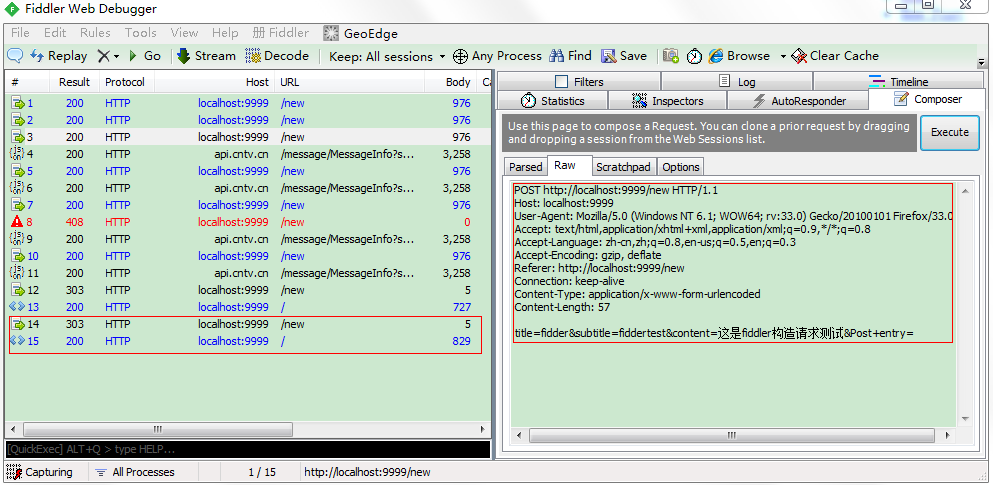
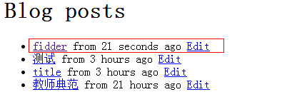
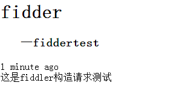
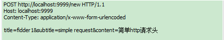

1. 科学上网法在公司试了上不来网，不知道是不是内网封了什么的原因

2. 偷懒直接抓取发文章的http请求，然后自己修改参数。本来想用fiddler直接抓包，但是fiddler好像不能抓本地请求，试了网上的解决方法，比如地址后面加‘.’或者配hosts文件，都不行。所以还是用浏览器自带工作台查看发文章的请求，然后在fiddler中构造，如图：

然后刷新blog页面，可发现通过fiddler构造请求发的文章：

点击可见文章详情：

又试了下自己写个最简单的请求（如下图），也是可以成功发文的。

http请求头参数太多，以前有看过每个的意义，但都是大概理解下，详细的释义还是记不住。

3. 将数据库改成了MySQL，用我本机的MySQL，如果你要跑得改下配置。

4. 这几天看了下Python，果然有很多有趣的特性，主要问题也是围绕这些特性的原理和使用方法，比如：
       + 本来觉得javascript的传参方式已经很灵活了，Python的更方便，实现的话应该是用指针吧。
       + 装饰器：这个只是大概看了下，从用法到原理都还不是很清楚
       + 闭包：js也有这个，感觉主要作用是封装。Python闭包与js的差异主要是什么
其实还有蛮多只是看了下，还不太搞得清具体怎么用，比如metaclass之类的，后面边写边学吧。