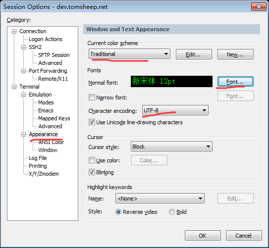
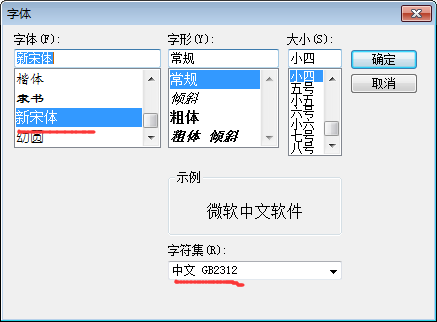
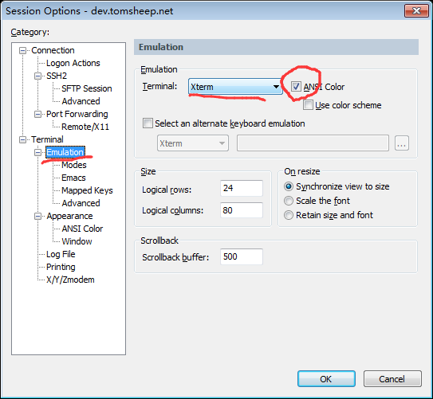

## SecureCRT配置

### Required
1. File菜单 -> Connect, 弹出对话框
2. 点击`New Session`图标（第三个），建立新连接，弹出向导
3. 选择ssh2协议，下一步
4. hostname填写`dev.tomsheep.net`, 端口22, username填写`pys`，下一步并完成
5. 在对话框中选择刚建立的session，点击connect按钮
6. 首次连接ssh客户端会询问你是否保存host key，选择`Accept & Save`
7. 输入密码，并勾选Save password，
8. 连接成功，获得远程shell

### Optional：
此时没有对这个session进行额外配置，白底黑字，也不能正常显示中文，可以进行如下配置

1. Options菜单-> Session Options
2. 左侧选择`Terminal->Appearance`, 将Current Color Scheme改为`Traditional`
3. 点击Font按钮, 选择一种支持中文的字体, 比如新宋体, 字符集从`西欧语言`改为`中文GB2312`。Optional：推荐`Yahei Consolas`这个字体，很适合term，Windows没有带这个字体，可以在我发给你的工具里找到，安装很简单，双击文件，选择`安装`即可。安装完后重启securecrt再次进入字体选择即可找到这个字体。
4. `Character Encoding`从default改为`UTF-8`
5. 左侧选择`Terminal->Emulation`, 将右侧Terminal从VT100改为`Xterm`，并勾选右侧的`Ansi Color`复选框

