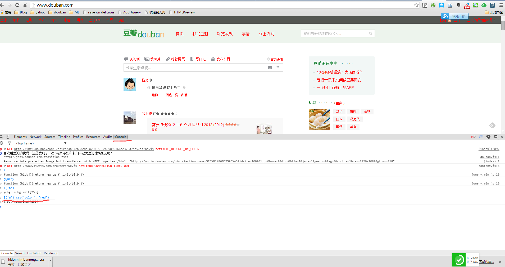

# Web02 - A Simple Blog Site

## 主要内容
通过一个由webpy编写的简易blog，介绍通用Web框架构成。

## Python
教程将以Python作为主要语言，原因是
1. 足够简单，容易掌握。可以将主要精力放在Web技术本身，而不至于时时fight with language
2. Python是一门自干五（自带五号干电池，英文称battery-included）的通用语言，不仅仅在Web领域有广泛的应用，在其他很多工作中都能帮你高效的完成任务，包括但不限于：  
    1. 运维或日常简单脚本任务
    2. 数据分析与科学计算
    3. 爬虫

我们会在后面的教程中穿插对比不同语言生态圈的Web解决方案，比如Node.js。随堂作业必须使用指定语言与工具，但小蒲可以用任何语言与框架完成大作业。通过比对可以多思考Web技术在不同环境下的"变与不变"。

由于一些历史原因，Python社区在2和3的版本之间产生了巨大裂痕，考虑到生态现状，我们教程使用2.7.X的版本。

#### Python语言入门
Codecademy网站有一份很好的交互式入门教程，建议花几个小时完成，对于初学者可以马上上手。[Codecademy Python教程](http://www.codecademy.com/zh/tracks/python)

## Case Study: A really simple blog site

### 概述
在[src](src)目录中，有一份极简的博客站点源码，由webpy框架协程，这个框架的核心非常精简，只有数千行代码，但五脏俱全，是一个功能完备的典型MVC web框架。因此非常利于学习，他的源码我也特意放在了项目中[src/web](src/web)，在理解一些核心概念时，最有效的学习方式就是去查阅相关部分的源码，希望小蒲养成这样的学习习惯。

### URL Mapping
有些框架叫Routing，完成网址路由功能。在Web应用中，一个url的入口往往对应一个特定的功能。这个模块通常是放在服务器端的，当然，近年来流行一种单页面Web App的构建方式，服务器只有一个页面入口，而MVC的各个功能模块都运行在浏览器中（JS实现），服务器只提供ajax数据服务。这种Web框架我们暂时不讨论，这里我们介绍的Web框架一般指传统的服务器端Web框架。我们先来看一个URL的组成:

    http://www.example.com/mine?a=1&b=2#tag

其中的组成部分有：

1. 协议名: `http`
2. Host: `www.example.com`
3. Port: `80`, 注意如果url中没有指明端口，则意味着使用HTTP的默认端口80
4. Domain: `www.example.com:80`, 注意不要混淆Domain和Host，Domain包括了Host+Port。`域`这个概念在Web开发中很重要，我们以后谈`跨域(Cross Domain)`问题时再来详细说。
5. Path: `/mine`, 我们所说Web框架的Routing，针对的就是path
6. Parameters: `a=1&b=2`, 参数由`?`开始，由`&`分隔
7. Hash: `#tag`, 这个主要用于内面内的元素定位。对于前面提到过的一些`客户端Web框架`，它还常被用来实现路由，这里同样不讨论。

所以，已经看出来了，对于（服务器端）Web框架而言，路由针对的只是url中的path部分。不同框架对url mapping的实现大同小异，无非是一个字符串匹配/查表的过程。webpy的路由实现可查看[`application._match`](src/web/application.py#L468)函数。而使用webpy的路由也很方面，只需要定义一个`path`和对应`controller classs`交替出现的iterable（list, tuple等）传入application的构造函数即可，可参见[blog的url mapping源码](src/blog.py#L8)

        urls = (
            '/', 'Index',
            '/view/(\d+)', 'View',
            '/new', 'New',
            '/delete/(\d+)', 'Delete',
            '/edit/(\d+)', 'Edit',
            )

### Controller

刚才我们在这个应用里定义了5个入口，分别对应首页、博客文章的浏览、创建、删除和编辑。 'Index', 'View', 'New'这些都是Controller的类名。webpy支持传字符串来标识Controller，而不要求非得传类对象，这里的好处是我们可以把url的定义放在Controller定义的前面，这里面的微妙之处，等你对python语言有一定了解之后就会有所体会。

一个Controller，就是一个path对应功能的入口，它是一个组织者，调配好响应这个请求的资源（调用Model获取数据等），设置HTTP响应头（很多情况下框架默认完成）、装配response（发起对应的模板渲染）完成一次请求。在webpy中，一个Controller就是一个class（其实不一定非是class，我们先这么认为），这个class定义了相应的`谓词`函数，说道HTTP的`谓词`，也叫方法，常见的有：

+ GET: 最常见了，一般用来实现只读的浏览行为，参数由url传递，就像上面讲url mapping时举得栗子一样。所有在浏览器中输入网址回车的访问都是GET请求。
+ POST: 第二常见，对应写操作，比如submit一个表单，和GET不同，参数通过HTTP的body传递。事实上通过浏览器正常的浏览行为（AJAX除外）发出POST请求只有通过submit表单才能实现（所以，一些修改状态，比如发帖啊，改用户资料啊这些请求应该用POST请求实现，如果用GET实现通常会视作严重的安全问题，想想为什么？）
+ 其余的谓词比如HEAD, PUT, DELETE等均不常用，在之后我们学习RESTful时再讨论。

webpy中实现不同谓词的方法就是在对应controller的class中定义相应名字的方法, 如GET, POST等，参见[src/blog.py](src/blog.py)

### Model
Model为业务数据而生。我们的网站通常需要涉及数据持久化，所以对数据库的操作一般都会封装到Model层。但不要把Model等同于ORM，Model是一个逻辑概念，你的数据Model未必是持久化存在数据库中的。

在这个例子中，我们把对博客文章的增删改查封装在model中，见[src/model.py](src/model.py)。而数据持久化层我们选用了sqlite3这个嵌入式单文件数据库作为backend，它的好处是简单而完备。首次运行blog.py会初始化数据库，在文件夹下创建blog.db文件，建表语句存放在[src/schema.sql](src/schema.sql)中。你也可以使用sqlite3的cli客户端来操作这个db文件（也就是数据库），安装好sqlite3：

    sudo apt-get install sqlite3   # for ubuntu

之后运行如下命令:

    sqlite3 blog.db

随后你会获得一个数据库连接，接下来你就可以用sql语句来操作它了（sqlite3支持的sql和mysql有一些不同之处）

    .tables   # 查看所有表
    .table entries  # 查看entries表信息
    select * from entries   # 这个你懂

### View
浏览器作为一个渲染页面的载体，只认识HTML这个标记语言（还有JS和CSS），所以服务器最终的结果是需要生成对应的html（对于有页面展示需要的请求而言），让浏览器欢快地展示给用户。如果我们的网站是纯静态的，那么只要把html文件存在硬盘里需要的时候扔回去就行了。可惜显然多数业务网站并不是这样，否则我们在这里还谈什么MVC。正是由于有这样动态的数据拼装需求，在服务器端，我们通常使用一套模板引擎，它定义一种用来生成最终html的模板，在请求来时，由controller发起，选择对应的模板进行渲染，将最终结果返回。

webpy自己实现了一个建议模板引擎（不要被`引擎`这个高大上的词语吓住了，其实不就是各种替换字符串，拼装数据么），在[src/templates](src/templates)目录中可以看到几个例子，聪明的你一定一下就明白了。

### 小结
这几乎就是这个栗子的全部了，你需要通读这个例子的代码，注意思考讲义中提到的概念。尝试增添或修改其中的几个功能，来增强自己的理解。webpy的源码不要求一定要读，当需要深入探究某组件原理时鼓励研读，这是一个很好的学习途径。

## Web开发/调试的几把杀猪刀
本节介绍几件web工程师常用的工具，可以说是必备工具，熟练掌握了之后不仅会大大提升你的效率，而且会加深你对Web技术的理解。在这里我们介绍的是：

+ Chrome Developer Tools: Chrome浏览器自带的调试工具，你也可以使用Firefox的Firebug插件，同样好用
+ Fiddler/Postman: HTTP抓包/调试工具

## Chrome Developer Tools
这个我相信你已经使用过了，调出它很容易，页面中`右键->审查元素`即可，它包括了很多调试工具，我们不一一介绍，只挑几个最常用的的功能：

### Elements
查看元素，可以查看/修改任意DOM元素，即改即见。

### Network
查看某个请求的HTTP详情

### Console
一个交互式JS调试台，不仅是页面调试利器，还是学习JS好地方

### Fiddler
Fiddler是一个HTTP抓包、分析、构造神器，是我能想到的Windows世界中为数不多的可以吊打`*nix`世界的开发工具，在我上一个教程底部给的百度云盘连接中，可以找到安装包。他需要.NET 4.0预装。他的功能非一时可以全部掌握，需要慢慢摸索。启动Fiddler之后会自动启动一个8888端口号的代理，浏览器设置这个代理之后就可以被Fiddler抓包了（一般情况下打开Fiddler时IE会自动设置上这个代理）

#### Composer

构造HTTP请求

### Inspector
分析HTTP请求

其余还有一些奇门遁甲，就不一一介绍了，自己多摸索，用熟了就会非常喜欢。

### Postman
在Linux/Mac平台下，还真没有像Fiddler这种量级的工具，所以大家各显其能，有很多工具来覆盖不同的侧面。比如[Postman](https://chrome.google.com/webstore/detail/postman-rest-client/fdmmgilgnpjigdojojpjoooidkmcomcm)这个chrome插件就可以用来构造HTTP请求

至于HTTP抓包，一般的需求Chrome Dev Tools就可以。curl, tcpdump等也是`*nix`平台下分析抓包的常用工具

## Homework
0. 在讲义中我提到修改状态的请求用GET实现通常被视作安全问题，为什么？举个栗子。
1. 通读blog示例代码，给文章增加一个`副标题`属性，并在view界面中显示出来，在edit页面中能够修改。
2. 练习Chrome Dev Tools和Fiddler的使用，希望他们成为你今后工作中的常用工具。

## 附录A - 运行示例代码方法
这个示例只依赖了一个外部python库，就是webpy，而它的源码已经被包含在项目里了，所以启动这个项目十分简单，只要安装了python环境（开发机已经预装2.7.6），运行

    python blog.py 9999

然后在你的浏览器里就可以访问`http://<host_ip>:9999`了

