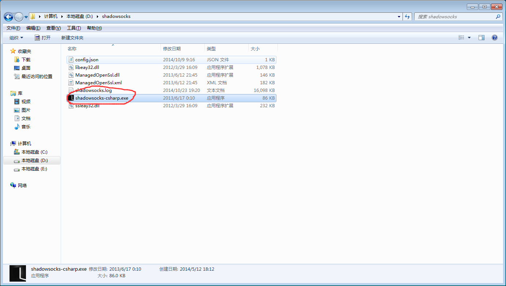
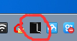
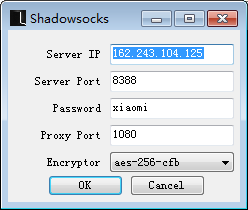
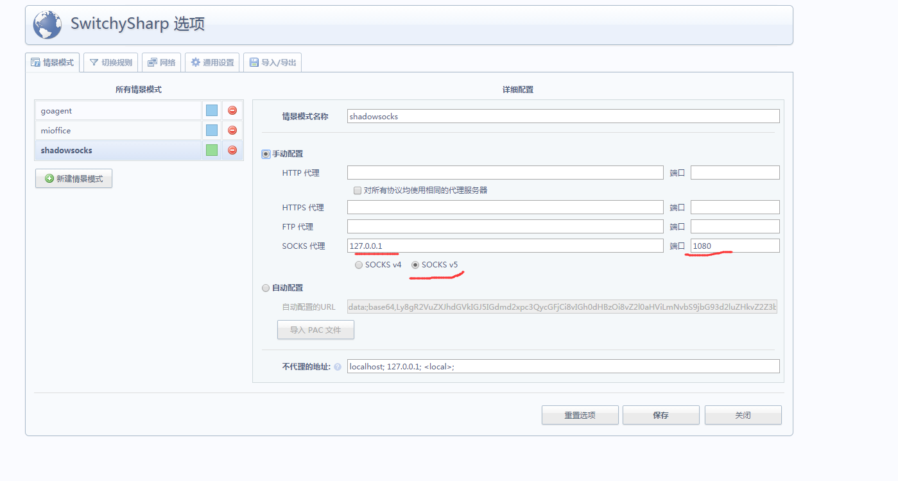

# 科学上网之shadowsocks

## 配置shadowsocks
1. 在第一节课的网盘链接里找到`shadowsocks.zip`
2. 解压，运行里面的exe文件（需要.Net已经安装），会在托盘里找到一个黑色图标，右键config可以查看配置。不用修改，我已经配好了
3. 它会在你本地开启一个1080端口的代理，然后你把浏览器的代理设置为127.0.0.1:1080即可，注意是socks5类型的，不是http代理
4. (Optional)推荐在Chrome下用这个代理插件（安装它本身需要翻墙） [switchysharp](https://chrome.google.com/webstore/detail/proxy-switchysharp/dpplabbmogkhghncfbfdeeokoefdjegm?hl=zh-CN)

如果用switchysharp，参照这个图。IE的话你应该知道怎么设置

